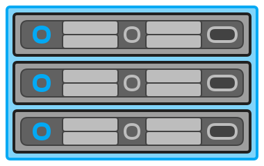
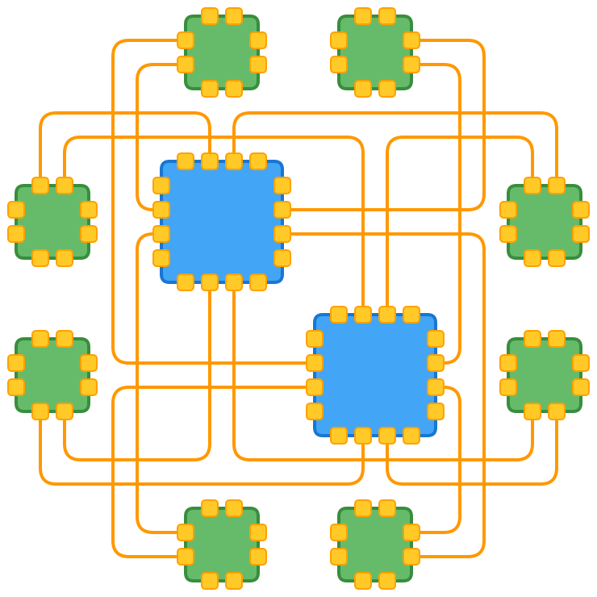
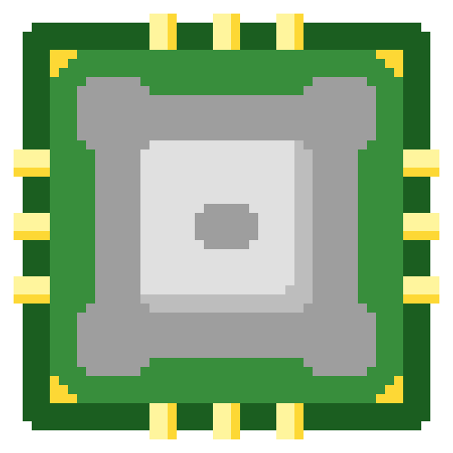
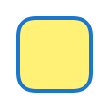

#### What
Fractal is both an image format specification, and an engine to render that format.  
In essence, Fractal allows you to focuse on the intent of your diagram and ask the engine to determine placement and method to correctly render it.  
Self-contained, pure javascript, browser rendered.  
SVG path object coordinates are always represented as whole integers - no fractions ever.  
Recursive rendering  
JSON Defined  
Automatic scaling  
Deterministic outcome  
Perfect Alignment of nodes  





#### Problem
create new diagrams are hard  
x,y positioning is annoying  
alignment of object is annoying  
linking objects is manual  
changes after-the-fact are hard  
symmetry, node placement, and line-routing techniques are manual and error prone    

#### Intent
Have an engine that allows one to create diagrams-as-code.  
Diagrams result in a cleanly-defined, minimal SVG image format  
Avoid manual x,y placement - all 'nodes' are automatically relatively aligned to geometric infrastructure of schema.  
Recursive in nature - schemas can externally referenced and reused, and schemas can be nested for recursive rendering.    
Templates can be build as infrastructure for node placement, nodes can then be added after the fact.  

#### Setup
- Create a plain html file, and link `head.load.js` in the `head` of the document.  
- Load the `fractal.js` engine along with the initial fractal **schema** to render - in this case `example1.js`.  
- Finally, create an anchor `svg` element, and call the `fractal.render` method via the `svg.onload` attribute.  
- Pass in a function to the `render` method - this function is specified in the `example1.js` asset

```html
<!DOCTYPE html>
<html>
	<head>
		<script src="head.load.js"></script>
		<script>
			head.load([
				'fractal.js',
				'example1.js'
			]);
		</script>
	</head>	
	<svg id='core' onload='start()' xmlns="http://www.w3.org/2000/svg" xmlns:xlink="http://www.w3.org/1999/xlink">
		<script>
			<![CDATA[
				function start() {
					fractal.render(example1());
				}
			]]>
		</script>
	</svg>
</html>
```

With a correctly formatted **schema**, the `fractal.js` engine will render the resultant object returned from `example()`, as a set of svg constructs.  

#### Schemas
##### So what is a **schema** and how do you define one?
Put simply, a fractal schema is a json object structured in certain way to define the relationship, relative position, size and style of **nodes** on a diagram.  
It defines where **nodes** are placed, relative to one-another, along with hints for css attributes (stroke, stroke-width, fill etc..).  
A **schema** also provides additional syntax to control certain construction attributes to influence placement, style and links between nodes.  

- **`body`**  
`body` is a 2 dimensional **ARRAY** of labels.  
It defines the *relative* spatial position of cells with respect to each other on the page.  
This is essentially used as a grid of coordinates to place `cells`.  
The `<cell-label>` is an arbitrary user-defined **INTEGER** that references the grid location.  
This is used by the `map` construct to decide what gets rendered there.  
`<cell-labels>` do not have to be unique - this allows for a `node` to be duplicated at multiple locations.  
Syntax of a cell `body` is:  
```javascript
body: [
	[<cell-label1>, <cell-label2> ... <cell-label3>],
	[<cell-label1>, <cell-label2> ... <cell-label3>],
	                      .
	                      .
	                      .
	[<cell-label1>, <cell-label2> ... <cell-label3>]
]
```
- **`map`**
the map does stuff  
talk about the map overrides
- `link`
links do stuff
- `size`
size is important
- `style`
styles well - style things
- `opts`
opts do things

For the **schema** file, it is defined as an external javascript asset (like `example1.js` above), with a single function returning a json object.  
Syntax of a single `cell` is:  
```javascript
cell: {
	body: [
		[<cell-label1>, <cell-label2> ... <cell-label3>],
		[<cell-label1>, <cell-label2> ... <cell-label3>],
		                      .
		                      .
		                      .
		[<cell-label1>, <cell-label2> ... <cell-label3>]
	]
}
```
This looks like:  
```javascript
function example1() {
	return {
		body: [
			[0]
		],
		map: {
			0: {}
		}
	};
}
```

This is the smallest possible **schema** definition supported by fractal to visibly render an object to the page.  
The resultant image rendered in the browser is:  
  
**Note:** As we did not specify any `opts` or a `style` to this object, CSS attributes have inherited their defaults.  

#### Examples
A number of examples for different diagram construction methods.  
For purposes of brevity - the `function` and `return` statements will be ommitted, with the examples instead focusing on their json construction syntax.  

##### oneNode
This example shows a single node.
It also defines `size`, `opts`, and `style` attributes.  
  
```javascript
{
	body: [
		[0]
	],
	map: {
		0: {
			size: {
				x: 8, y: 8
			},
			opts: {
				radius: 20
			},
			style: {
				"stroke": "mBlue-700",
				"stroke-width": 4,
				"fill": "mYellow-300"
			}
		}
	}
}
```
- 9-Node  
- 9-Node-Gap  

#### TODO - in no particular order
##### Engine
- Use javascript to dynamically specify svg element height/width at build time
- Anchor resultant image at 0,0 within SVG, and use HTML CSS to shift asset into viewable window
- Allow for native SVG/PNG export (via right-click)
- Replace head.js with custom, minimal asset loader with added svg embedded script load support
- Implement lexical local/global link tags
- Implement proper {style} inheritance between cell parents and children - currently broken - need to merge {style} attrs
- Optimise and collapse engine components (fewer js files)
- Collapse {size} into {opts} construct
- Correct global {opts} inheritance

##### Compiler
- Optimise resultant SVG to leverage chained <use xlink> for smaller output
- Deduplicate CSS classes and move to defs
- Add circle and rect support for compiled output

##### Interface
- Add svg text support


